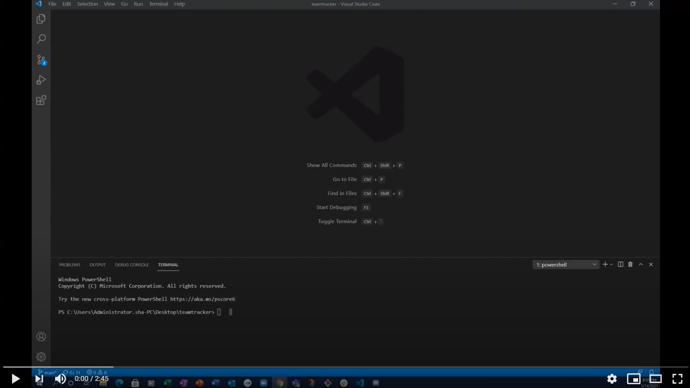
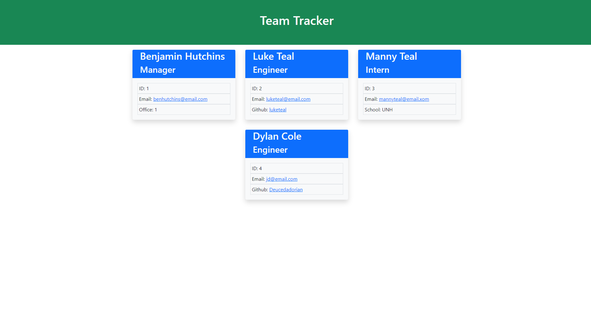

# TeamTracker

## Description 
This is a nodejs terminal application to dynamically create an HTML based webpage of a project team including the Manager, Engineers, and Interns.

The project uses inquirer through node js to generate HTML (utilizing Bootstrap for styling). 
The project utilizes Bootstrap.
## Table of Contents 
* [Description](#Description)  
* [Installation](#Installation)  
* [Usage](#Usage)  
* [Repo-Contents](#Repo-Contents)  
* [License](#License)  
* [Contributing](#Contributing)   
* [Questions](#Questions)
* [Credits](#Credits)  

## Installation
In the terminal, navigate to the parent folder of the README Generator project files and run `npm install`

## Usage 
1. Navigate to the parent folder of the project files and run `node index.js`
2. Answer the questions as prompted
3. The `index.html` file is saved in the dist folder. An example output is [here](./dist/index.html)

### Video

### Screenshot
The image below shows is the website generated by the TeamTracker app:

## Repo-Contents
* js files (application)
* package.json files (run npm install to install necessary dependencies)
* test files used in development
* example index.html file

## License
TeamTracker is MIT licensed

## Contributing 
Feel free to contribute to this project by forking the repo, making your changes and creating a pull request when you're ready.

## Questions
If you have any questions, contact me:

Email: l.teal21@gmail.com

[GitHub Profile](https://github.com/luketeal)

## Credits
* The project utilizes Bootstrap, and inquirer, and uses jest for development testing.